# Grafo de dependencias ETL → DuckDB

Este archivo documenta las dependencias identificadas a partir de los
`datasets.yml`, `pipelines.yml` y SQL proporcionados.

## Flujo global

```mermaid
flowchart TD
    RAW_AIRE[RAW: datos_aire/*.csv] --> AIRE_N[aire_normalizado]
    RAW_METEO[RAW: aemet_diarios_2020_2024.csv] --> METEO_N[meteo_aemet_normalizado]

    VAR_AIRE[RAW: variable_aire.csv] --> AIRE_N
    VAR_METEO[RAW: variables_meteo.csv] --> METEO_N

    VAR_AIRE --> SEED_VAR_AIRE[seed_variables_aire]
    VAR_METEO --> SEED_VAR_METEO[seed_variable_meteo]

    RANGOS[RAW: rangos_variables_aire.csv] --> SEED_RANGOS[seed_rango_variables_aire]
    FESTIVOS[RAW: festivos.csv] --> SEED_FESTIVOS[seed_festivos]

    AIRE_N_OUT[(normalized/fact/calidad_aire_historico.parquet)] --> AIRE_E[aire_enriched]
    METEO_N_OUT[(normalized/fact/meteo_aemet_historico.parquet)] --> METEO_E[meteo_enriched]

    SEED_RANGOS_OUT[(normalized/static_files/seed_rango_variables_aire.parquet)] --> AIRE_E
    SEED_FESTIVOS_OUT[(normalized/static_files/seed_festivos.parquet)] --> AIRE_E

    META_AIRE[RAW: metadata_estaciones_aire.csv] --> AIRE_E
    META_METEO[RAW: metadata_estaciones_meteo.csv] --> DIM_AIRE[metadata_estaciones_aire]
    META_METEO --> DIM_METEO[metadata_estaciones_meteo]
    META_AIRE --> DIM_AIRE

    AIRE_E --> AIRE_E_OUT[(enriched/fact/calidad_aire_final.parquet)]
    METEO_E --> METEO_E_OUT[(enriched/fact/meteo_final.parquet)]
    DIM_AIRE --> DIM_AIRE_OUT[(enriched/dims/dim_estaciones_aire.parquet)]
    DIM_METEO --> DIM_METEO_OUT[(enriched/dims/dim_estaciones_meteo.parquet)]

    AIRE_E_OUT --> DB[(TFM.duckdb)]
    METEO_E_OUT --> DB
    DIM_AIRE_OUT --> DB
    DIM_METEO_OUT --> DB
    AIRE_N_OUT --> DB
    METEO_N_OUT --> DB
    SEED_VAR_AIRE --> DB
    SEED_VAR_METEO --> DB
    SEED_RANGOS_OUT --> DB
    SEED_FESTIVOS_OUT --> DB
```



## Orden de ejecución

```text
1. NORMALIZED
   ├── aire_normalizado
   ├── meteo_aemet_normalizado
   ├── seed_variables_aire
   ├── seed_variable_meteo
   ├── seed_rango_variables_aire
   └── seed_festivos

2. ENRICHED
   ├── aire_enriched
   ├── meteo_enriched
   ├── metadata_estaciones_aire
   └── metadata_estaciones_meteo

3. DUCKDB
   └── Views sobre todos los Parquet disponibles
```

## Dependencias principales

| Pipeline | Sources | Output |
|---|---|---|
| aire_normalizado | aire20, aire21, aire22, aire23, aire24C6H6, aire24CO, aire24NO, aire24NO2, aire24NOx, aire24O3, aire24PM10, aire24PM25, aire24SO2, dim_variable_aire_csv | `data/normalized/fact/calidad_aire_historico.parquet` |
| meteo_aemet_normalizado | aemet_climatologia_diaria, dim_variable_meteo_csv | `data/normalized/fact/meteo_aemet_historico.parquet` |
| seed_variables_aire | dim_variable_aire_csv | `data/normalized/static_files/seed_variable_aire.parquet` |
| seed_variable_meteo | dim_variable_meteo_csv | `data/normalized/static_files/seed_variable_meteo.parquet` |
| seed_rango_variables_aire | rango_calidades_csv | `data/normalized/static_files/seed_rango_variables_aire.parquet` |
| seed_festivos | seed_festivos | `data/normalized/static_files/seed_festivos.parquet` |
| aire_enriched | aire_normalized_ds, seed_rangos_aire, seed_festivos, seed_estaciones_aire | `data/enriched/fact/calidad_aire_final.parquet` |
| meteo_enriched | meteo_normalized_ds | `data/enriched/fact/meteo_final.parquet` |
| metadata_estaciones_aire | seed_estaciones_aire, seed_estaciones_meteo | `data/enriched/dims/dim_estaciones_aire.parquet` |
| metadata_estaciones_meteo | seed_estaciones_meteo | `data/enriched/dims/dim_estaciones_meteo.parquet` |

## Dependencias SQL confirmadas

### aire_enriched

`enriched_aire.sql` utiliza:

- `aire_normalized`
- `metadata_estaciones_aire`
- `seed_rangos_aire`
- `tabla_festivos`

El SQL usa `metadata_estaciones_aire` para coordenadas de estaciones,
`seed_rangos_aire` para clasificación de calidad y `tabla_festivos` para
determinar días laborables.

### meteo_enriched

`enriched_meteo.sql` utiliza:

- `meteo_normalized`

El proceso aplica las reglas B1-B5 de limpieza, interpolación,
imputación y completitud.

## Nota sobre dependencias entre pipelines

No se ha identificado una dependencia directa entre outputs de `enriched`
y otras pipelines de `enriched`.

Las pipelines de `enriched` consumen principalmente Parquet generados por
`normalized` y algunos CSV estáticos de `raw`.

Por ello, el DAG operativo mínimo es:

```text
normalized → enriched → DuckDB
```

No es necesario implementar un DAG dinámico entre las pipelines mientras
esta configuración YAML se mantenga.
